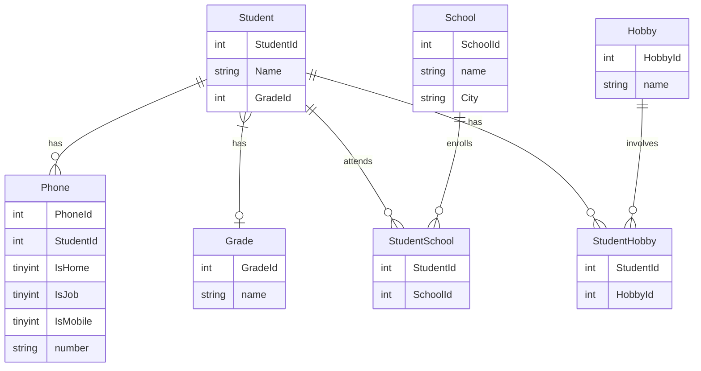

<h3><strong><em>Entity Relationship Diagram</h3></strong></em>
<h4><strong><em>Redovisning</h4></strong></em>

## Redovisning för kursen DB2022. 


<h2><strong><em>We start by borrowing a relational database.</h2></strong></em>

```bash
docker pull mysql/mysql-server:latest
```
<h2><strong><em>Create an image for the container so we can execute code</h2></strong></em>

```bash
docker run --name iths-mysql\
	   -e MYSQL_ROOT_PASSWORD=root\
	   -e MYSQL_USER=auser\
	   -e MYSQL_PASSWORD=iths\
	   -e MYSQL_DATABASE=iths\
	   -p 3306:3306\
	   --tmpfs /var/lib/mysql\
	   -d mysql/mysql-server:latest
```

<h2><strong><em>Start mysql</h2></strong></em>

```bash
docker start iths-mysql
```
<h2><strong><em>Start git bash</h2></strong></em>

```bash
docker exec -it iths-mysql bash
```
