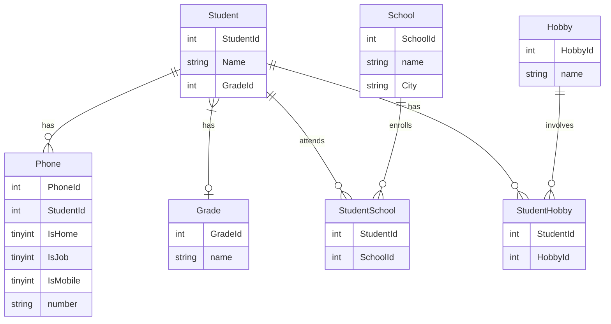

<h3><strong><em>Entity Relationship Diagram</h3></strong></em>
<h4><strong><em>Redovisning</h4></strong></em>

## Redovisning för kursen DB2022. 


<h4><strong><em>Start by borrowing a relational database.</h4></strong></em>

```bash
docker pull mysql/mysql-server:latest
```
<h4><strong><em>Create an image for the container so we can execute code</h4></strong></em>

```bash
docker run --name iths-mysql\
	   -e MYSQL_ROOT_PASSWORD=root\
	   -e MYSQL_USER=auser\
	   -e MYSQL_PASSWORD=iths\
	   -e MYSQL_DATABASE=iths\
	   -p 3306:3306\
	   --tmpfs /var/lib/mysql\
	   -d mysql/mysql-server:latest
```

<h4><strong><em>Start mysql</h4></strong></em>

```bash
docker start iths-mysql
```
<h4><strong><em>Start git bash</h4></strong></em>

```bash
docker exec -it iths-mysql bash
```
<h4><strong><em>Download a SQL script</h4></strong></em>

```bash
curl -L  https://gist.github.com/miwashiab/e39a3228f0b389b6f3eca1b8c613bb2e/raw/db.sql -o db.sql (as an example)
```

<h4><strong><em>Run the downloaded SQL-script</h4></strong></em>

```bash
docker exec -i container-with-mysql mysql -uroot -proot < db.sql
winpty docker exec -it container-with-mysql bash
```

<h4><strong><em>Inside the mysql container</h4></strong></em>

```bash
mysql -uroot -proot
```
<h4><strong><em>Inside MySQL</h4></strong></em>

```bash
show databases;
use database;
show tables;
```


